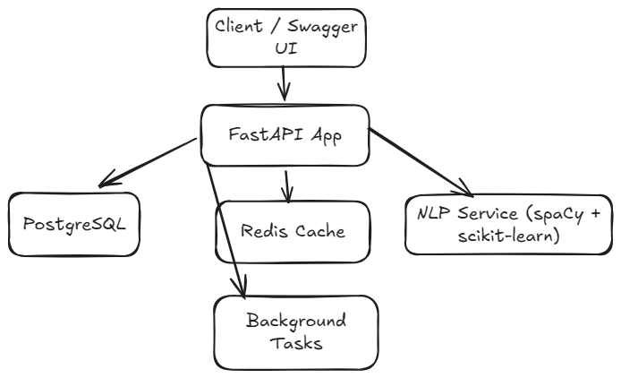

# Smart Job Tracker API

A FastAPI-powered REST API that tracks job applications and scores your resume against job descriptions using NLP.

## Demo

## Architecture

## Features
- ✅ Full CRUD for job applications with pagination, search, and status filtering
- ✅ JWT-based registration/login, per-user data isolation
- ✅ NLP resume scorer: TF-IDF cosine similarity + missing-keyword extraction
- ✅ Async background jobs (auto-scoring, notifications, stale job detection)
- ✅ Redis caching with cache invalidation
- ✅ Analytics: summary stats, application funnel, top matches, weekly timeline
- ✅ Rate limiting, structured logging, centralized error handling
- ✅ Dockerized (app + Redis via docker-compose)
- ✅ CI/CD with GitHub Actions, Ruff linting, Codecov
- ✅ 83%+ test coverage

## Tech Stack

| Technology | Purpose |
|---|---|
| FastAPI | REST API framework |
| SQLAlchemy + Alembic | ORM + database migrations |
| PostgreSQL | Primary database |
| Redis | Caching layer |
| JWT (python-jose) + Passlib | Authentication & password hashing |
| scikit-learn | TF-IDF resume scoring |
| spaCy | Keyword extraction |
| pandas | Analytics aggregation |
| slowapi | Rate limiting |
| pytest + pytest-cov | Testing |
| Docker + docker-compose | Containerization |
| GitHub Actions + Codecov | CI/CD |

## API Endpoints

| Method | Endpoint | Auth | Description |
|---|---|---|---|
| POST | /auth/register | No | Register a new user |
| POST | /auth/login | No | Login, returns JWT |
| POST | /jobs/ | Yes | Create a job application |
| GET | /jobs/ | Yes | List jobs (paginated, filterable) |
| GET | /jobs/{id} | Yes | Get a single job |
| PUT | /jobs/{id} | Yes | Update a job |
| DELETE | /jobs/{id} | Yes | Soft-delete a job |
| POST | /jobs/{id}/score | Yes | Score resume against job description |
| GET | /jobs/stale | Yes | Detect stale applications |
| GET | /analytics/summary | Yes | Application summary stats |
| GET | /analytics/funnel | Yes | Applied→Interview→Offer funnel |
| GET | /analytics/top-matches | Yes | Top 5 jobs by match score |
| GET | /analytics/timeline | Yes | Applications per week |
| GET | /health | No | Health check |

## Quick Start (Local)

\`\`\`bash
git clone https://github.com/Hashir-Qadeer/job-tracker-api.git
cd job-tracker-api

python -m venv .venv
.venv\\Scripts\\activate

pip install -r requirements.txt
python -m spacy download en_core_web_sm

# copy .env.example to .env and fill in your PostgreSQL + Redis credentials
alembic upgrade head
uvicorn app.main:app --reload
\`\`\`

Visit `http://127.0.0.1:8000/docs` for interactive API docs.

## Running with Docker

\`\`\`bash
docker-compose up --build
\`\`\`

## Tests

\`\`\`bash
pytest --cov=app tests/ -v
\`\`\`

## License

MIT